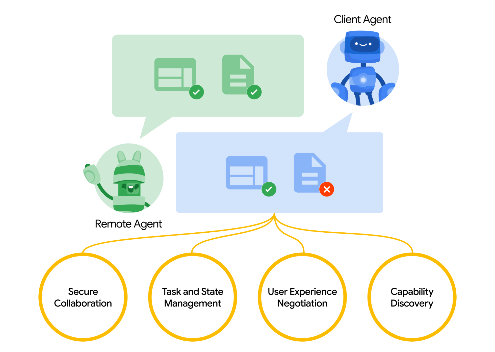

## 목차
1. [RAG (Retrieval-Augmented Generation)](#RAG-(Retrieval-Augmented-Generation))
    - [RAG를 사용하는 이유](#1-rag를-사용하는-이유)
    - [작동 원리](#2-작동-원리)
    - [참고자료](#📎-참고자료)

<br/>

# RAG (Retrieval-Augmented Generation)

## 1. RAG를 사용하는 이유

> **RAG란?**  
> LLM이 외부 지식(DB, 문서 등)을 검색해서 참고한 뒤, 그걸 바탕으로 응답을 생성하는 방식임.

---

### 1) 허위 응답을 제어하여 신뢰성 있는 답변을 얻을 수 있음

- LLM은 학습된 범위 내에서만 답변 가능하기 때문에, 답이 없을 경우 그럴듯한 허위 정보(Hallucination)를 만들어내기도 함.
- 하지만 RAG는 외부 문서 기반의 응답이므로 보다 정확하고 신뢰성 있는 답변을 이끌어낼 수 있음.

### 2) 최신 정보를 사용자에게 제공할 수 있음

- LLM은 학습 이후 고정된 정보를 기반으로 응답하지만, RAG는 외부 문서만 갱신하면 최신 정보도 반영 가능.

### 3) 비용적으로 효율적임

- FM ( ≈ Base Model )을 조직이나 도메인별 정보를 위해 재교육하기 위해선 비용이 많이듬.

### 4) 개발자의 제어력 강화 ⭐️⭐️

- LLM은 확률 분포 기반으로 가장 그럴듯한 응답을 생성하기 때문에 아래와 같은 한계가 존재함.

  - 출처 불명: 어떤 데이터에 기반한 응답인지 확인 불가
  - 고정된 지식: 프롬프트만으로는 새로운 요구사항 반영 어려움
  - 보안 제약: 학습되지 않은 민감정보 접근 불가 / 학습된 정보는 제어 어려움
  - 수정 어려움: 잘못된 응답의 원인 추적 또는 수정이 어려움
  - 테스트 비효율: 모델 자체를 수정해야 하므로 반복 테스트 번거로움

- 이러한 한계는 Retrieval-Augmented Generation (RAG) 방식으로 보완할 수 있음.

---

### RAG의 해결 방식 요약

| 문제 | RAG의 해결 방식 |
|------|------------------|
| 출처 불명 | LLM이 참고할 문서의 출처를 명시적으로 지정 가능 |
| 지식 고정 | 문서만 바꿔도 응답 변화, 다양한 요구사항에 적응 가능 |
| 보안 문제 | 인증 기반 문서 접근 제한 가능 |
| 수정 어려움 | 문서 기반이므로 즉각적인 소스 수정 가능 |
| 테스트 어려움 | "문서 수정 → 응답 확인" 루틴으로 개선 속도 향상 |

---

## 2. 작동 원리


---

### 1) 외부 데이터 생성

- API, 데이터베이스, 문서 리포지터리 등에서 외부 데이터 수집
- 수집된 데이터를 임베딩(Embedding) 하여 벡터 형식으로 변환하고 벡터 DB에 저장

### 2) 쿼리 임베딩 및 관련 정보 검색

- 사용자 쿼리를 벡터 표현으로 임베딩
- 벡터 DB에서 유사도가 높은 문서를 검색하여 관련 정보 추출

### 3) 문서 청킹 및 컨텍스트 삽입 (Chunking + Enhanced Context Injection)

- 검색된 문서를 문맥에 맞게 청킹(Chunking)  
  → 긴 문서를 작은 단위로 나누어 검색 정확도 향상
- 적절히 나눠진 정보를 LLM 프롬프트에 삽입  
  → Context Injection을 통해 더 정확한 응답 유도

### 4) 응답 생성

- 확장된 프롬프트를 바탕으로 Generator(GPT 등)가 응답 생성

### 5) 데이터 최신화 관리

- 문서의 변경 사항 반영을 위해 비동기 또는 배치 방식으로 임베딩 갱신
- 실시간 처리 또는 주기적 작업을 통해 항상 최신 정보를 반영

---

### 📎 참고자료
- [AWS - What is Retrieval-Augmented Generation?](https://aws.amazon.com/ko/what-is/retrieval-augmented-generation/)

# A2A (Agent-to-Agent)

## 1. A2A

> **A2A란?**  
> 단순히 사람이 LLM에 질문하고 답변받는 게 아니라, Agent(지능 단위) 들이 목표를 이루기 위해 서로 대화하고, 요청하고, 결과를 주고받으면서 일하는 것

---

### 1) A2A의 핵심 개념

| 요소 | 설명 |
|------|------------------|
| Agent | 독립적으로 목표를 가지고 사고하고 행동하는 지능 단위 |
| 통신 | Agent끼리 직접 메시지를 주고받으며 협력 |
| 자율성 | 각 Agent가 스스로 의사결정하고, 필요할 때 다른 Agent를 호출 |
| 협업 | 복잡한 문제를 해결하기 위해 여러 Agent가 역할을 나누고 협력 |

### 2) A2A 프로토콜
A2A는 HTTP(S)를 통한 JSON-RPC 2.0을 통신 메커니즘으로 사용하며, 서버 발신 이벤트(SSE)를 지원하여 업데이트를 스트리밍 함.

### 3) A2A 상호작용


> A2A는 두 에이전트가 서로 어떻게 상호작용하는지 정의하는 구조화된 모델을 제공함. <br/>
> **클라이언트** 와 **원격** 에이전트로 구분되며, 각 에이전트의 역할은 명확하게 나뉨. 

1. A2A 상호작용 모델
    - **클라이언트 에이전트**: 작업을 요청하거나 시작
        → 필요한 작업을 수행할 파트너 에이전트를 찾아내기 위해 **기능 탐색**을 수행
    - **원격 에이전트**: 클라이언트 에이전트로부터 요청을 수신 + 처리

2. 에이전트 발견

    > 클라이언트 에이전트가 작업에 적합한 원격 에이전트를 찾는 과정은 **에이전트 발견(Agent Discovery)** 과정 <br/>
    -> 클라이언트는 각 에이전트가 제공하는 기능과 서비스에 대한 정보를 탐색하기 위해 **에이전트 카드(Agent Card)** 를 조회

    <br/>

    *"에이전트 카드" 란?* <br/>
    각 에이전트가 자신을 설명하는 문서. 일반적으로 표준 URL인 `/.well-known/agent.json`에 게시됨. 
    - **기능**: 에이전트가 제공하는 서비스나 기능에 대한 설명
    - **기술**: 에이전트가 사용하는 기술 스택 및 프로토콜
    - **API 엔드포인트**: 에이전트와의 통신을 위한 URL
    - **인증 요구사항**: 에이전트와 통신을 위해 필요한 인증 정보

    에이전트 카드 읽기
    - 클라이언트 에이전트는 이 에이전트 카드를 읽고, 작업을 수행할 수 있는 적합한 파트너 에이전트를 식별함.
    - 에이전트 카드에 포함된 정보를 바탕으로 클라이언트는 파트너를 선택하고, 요청을 전송함.

3. 작업(Task) 객체 전송
    > 적합한 원격 에이전트를 선택한 후, 클라이언트 에이전트는 **작업(Task) 객체**를 생성 후, 원격 에이전트에게 작업 데이터 전송.


### 4) 사용사례
> A2A를 이용한 온보딩 프로그램 실제 사례


| 에이전트                        | 책임                             |
|---------------------------------|----------------------------------|
| `hr-agent.company.com`         | 직원 기록 생성, 문서 전송        |
| `it-agent.company.com`         | 이메일 계정 생성, 노트북 주문    |
| `facilities-agent.company.com` | 책상 할당, 출입 배지 발행        |

``` OnboardingPro라는 다중 에이전트 시스템이 전체 온보딩 워크플로를 조정.```

1) 탐색
각 에이전트의 `.well-known/agent.json` 파일을 읽어 기능과 인증 정보를 파악.

2) 작업 위임
- **HR 에이전트**에 `createEmployee` 작업 전송
- **IT 에이전트**에 `setupEmailAccount` 및 `orderHardware` 작업 전송
- **시설 관리 에이전트**에 `assignDesk` 및 `generateBadge` 작업 전송

3) 스트리밍 업데이트
각 에이전트는 서버 발신 이벤트를 사용하여 진행 상황을 스트리밍.
- 예시: "노트북 배송됨", "책상 할당됨"

4) 아티팩트 수집
최종 결과는 A2A 아티팩트로 반환됨:
- 예시: PDF 배지, 확인 이메일, 계정 자격 증명

5) 완료
**OnboardingPro**는 온보딩이 완료되면 담당 채용 관리자에게 알림을 보냄.

### 📎 참고자료
- [A2A protocol](https://google.github.io/A2A/#/)
- [A2A vs MCP: 새로운 에이전트 생태계를 위한 두 개의 보완적 프로토콜](https://blog.logto.io/ko/a2a-mcp)
